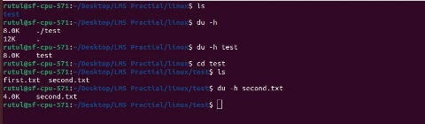
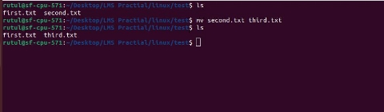
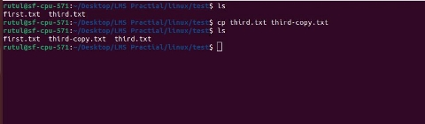
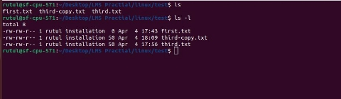
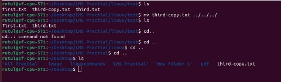
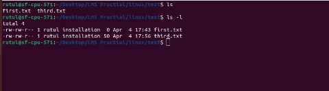
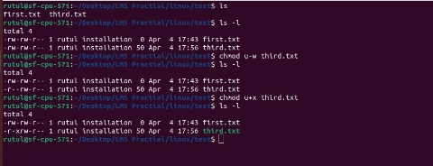
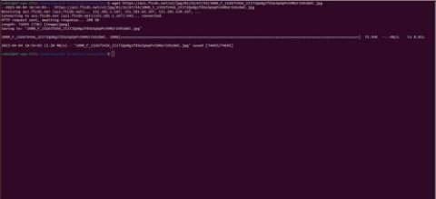
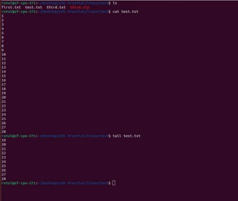
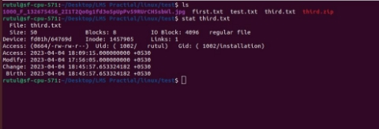

# Manipulating Files and Directories
### 1) pwd command
``` => pwd command is used to show the location of current working directory. ```


### 2) mkdir command

``` 
=> basically mkdir command is used for creating directory or folder.
=> mkdir <directory/folder name> 
```


### 3) rmdir command
```

=> rmdir command is used for remove directory. But there is one condition using rmdir command we can remove only empty folder.
=> rmdir <folder/directory name>
```


### 4) ls command
```

=> ls command is used for listing the file and directories.
=> using ls –l we can check the permissions of files and directories.
```


### 5) cd command   
```

=> Basically cd command is used for change the directory.
=> cd <directory name>
```


### 6) touch command  
```

=> basically touch command is used to create empty file.
=> touch <file name>
```


### 7) rm commad 
```

=> rm command is used to remove the files.
=> when we want to remove directory that contain the files using rm –r command we can remove that particular directory.
=> rm [file name] / rm –r [directory name]
```


### 8) cp command
```

=> cp command is used to make the copy of the files or directory.
=> cp [source file name] [copied file name]
```

 1) copy file


 2) copy directory


### 9) mv command
```

=> basically mv command is used for move the file or folder form one directory to another directory.
=> using mv command we can also rename the file.
=>move file : mv [source filename] [destination]
=> Rename File : mv [old file name] [new file name]
```

1) move file from one directory to another.


2) move directory from one directory to other.


3) rename the file using mv command


### 10) cat command
```

=> Basically cat command has a multiple use.
```

1) create file
```
=> cat <file name>
```


2) display content of file


3) insert data into new file or existing file


========================================================================================================

# List all file permissions with example

=> Basically in linux there has 3 types of user and 3 types of permissions.
```
* Types of user *
1) user
=> user denoted by u
2) group
=> group denoted by g
3) other user
=> other user denoted by o
```

```
* Types of Permissions *
1) read
=> it’s denoted by r
2) write
=> it’s denoted by w
3) Exectute
=> it’s denoted by e
```

=> we can check the file or directory permission using ls –l command like this


===================================================

# List all running process

=> Basically using ps command we can list the all running process like this


===================================================

# Find particular process by it's name

=> we can find the particular process by it’s name using pidof command like this


===================================================

# Change file owner and group

```

=> for change the file ownership there us chown cmd used.
=> for change the group ownership there is chgrp cmd used.
=> using this command we can check the file ownership & group ownership like this
 Ls –l <file name>
=> Here file ownership is rutul & group ownership is installation.
```


```
=> sudo chown root first.txt = using this command we have change
the file ownership from rutul to root like this
```


===================================================

# Change group ownership

```

=> using chgrp command we can change the group ownership.
=> using this command we can check the file ownership & group ownership like this
 Ls –l <file name>
=> here we can the group ownership is installation.
=> now we will change the group ownership from installation to root using this command.

sudo chgrp root first.txt
```


===================================================

# Vi or Vim for file editing

=> we can easily edit the file using vi editor.

```
1) vi <file name>
```


```

2) vi editor will open
```


```

3) now if we want to insert then press I so it will convert into insert mode so
we can insert content.
```


```
4) now after inserting press ESC.
```

```
5) then press : and write wq like this :wq it will save the file and exit from the vi
editor and go back to the terminal like this.
```


```
6) it will back to the terminal
```


===================================================

# How to Search in Vim/Vi

```
1) first of all we have to open the any file in vi editor.
2) press ESC
3) then we have to write like this :
%s/(searching element)
Let's take an example.
```


===================================================

# How Do You Do A Search And Replace in Vim/Vi

```
1) first of all we have to open the any file in vi editor.
2) press ESC
3) then we have to write like this :
%s/(searching element)/(enter text you want tor replace)
* Here we search the language and then replace it with lan.
```


===================================================
===================================================

# Linux Practical Exam

### 1) Write a command to create new folder.

```
=> mkdir <folder name >
=> Here we are creating test folder using mkdir command.
```


### 2) Write a command to find the current path of the folder.

```
=> pwd
=> using pwd command we can find the current path of the folder.
```


### 3) write a command to move into new created folder.

```
=> cd
=> using cd command we can change the directory.
```


### 4) write a command to create new file.

```
=> we can create a new file using 2 command touch & cat
=> touch <filename>
=> cat > <filename>
```


### 5) write a command to add some content in a file.

```
=> we can add the content in file using cat > filename like this
```


```
=> if we want to add content below the existing content then we can write command like this cat >> second.txt
```


### 6) write a command to find a specific word from a file..

```
=> for find specific word from file we can use the grep command
=> grep option “search word” <file name>
```


### 7) write a command to find the size of a file.

```
=> we can find the size of the file and folder using du –h command like this
```




### 8) write a command to rename that file.

```
=> for rename the file we can use the mv command
=> mv [old file name] [new file name]
```



### 9) write a command to make a copy of a file with another name.

```
=> for make a copy of one file to another name we can use the cp command like this.
=> cp [source filename] [copy filename]
```



### 10) write a command to show the list of files in folder.

```
=> for the list of file or folder we can use the ls command.
=> ls command will only show the all files. ls –l command will show all the file with it’s permission like this
```



### 11) write a command to move that file to desktop.

```
=> for move the file from one folder to desktop we can use the mv command like this.
=> mv [filename] [destination]
```




### 12) write a command to change permissions of the file.

```
=> for change the file permission we can use the chmod command.
```



```
=> here we can see the in third.txt file
 - user has read & write permission.
 - group has read & write permission.
 - other user has only read permission.
=> now let’s change the permission of user. We will remove the write permission from the user and add execute permission like this
```



### 13) write a command to delete file.

```
=> for delete the file we can use the rm command like this.
=> rm [file name]
=> here we will remove the text.txt file using rm command
```


### 14) write a command to delete created folder.

```
=> for deleting the folder we can use the rmdir command.
=> using rmdir we can remove those folder which does not contain any files.
=> here we will remove the test folder.
```


### 15) write a command to command to find a any file on local machine.

```
=> for finding any file on local machine we can use the find command.
```


### 16) write a command to create a zip of files from specific path on local machine.

```
=> using zip command we can create a zip file of any folder or file.
=> zip [zip file name] [existing file name]
```


### 17) write a command to unzip.

```
=> for unzip the file we can use the unzip command.
=> unzip [zip folder name]
```


### 18) write a command to download file from specific location on the internet.

```
=> for download the file from the specific location we can use the wget command.
=> wget[url]
```



### 19) Write command to see last 10 lines of a file.

```
=> basically for that we can use the tail command it will bydefault show the last 10 line of the file.
```



### 20) Write command to see history of a file.

```
=> For getting the file history we can use the stat command.
```




